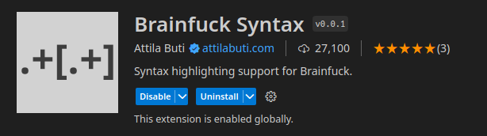
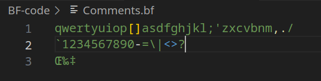
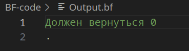
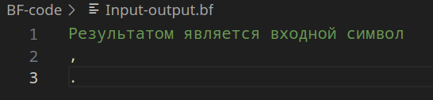
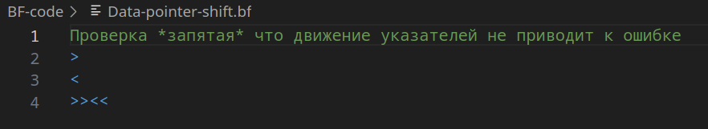
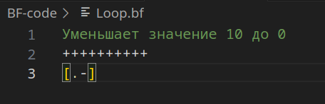
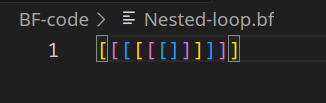
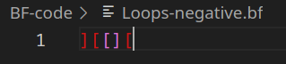
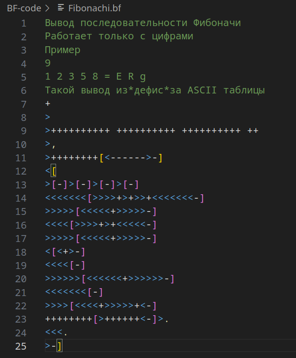

# Верификация интерпретатора brainfuck
В качестве интерпретатора был взят модуль из пакетного менеджера `apt`.

Для уставновки надо запустить:
```bash
sudo apt install bf
```

В папке `BF-code` лежит колд для тестов. 

Запуск тестов:
```bash
python3 main.py

python3 main.py --verbose  # запуск подробного отчета
```

# Верификация расширения brainfuck
Для верификации расширения VSCode была выбрана подсветка кода brainfuck.

`attilabuti.brainfuck-syntax`



В качестве примеров кода были взяты файлы, используемые в верификации интерпретатора.

## Комментарии
Все символы крооме `[]<>.,-` были подсвечены зеленым как комментарии, что соответствует стандарту языка.



`Корректно`

## Вывод на экран
Расширение подсвечивает желтым цветом символ `.`, отвечающий за вывод данных в консоль.



`Корректно`

## Ввод-вывод 
Оператор считывания входных данных был подсвечен также желтым цветом, поскольку он тоже относится в IO операциям.



`Корректно`

## Операторы смещения
Все операторы смещения были подсвечены синим цветом.



`Корректно`

## Условные переходы
Границы условных переходов были отмечены верно.



`Корректно`

## Вложенные переходы
Для обозначения вложенных условных переходов доступно 3 цвета.
Ими было правильно обозначены отношения между переходами.



`Корректно`

## Неправильные переходы
Красным цветом отмечается неправильная скобочная последовательеность.
В данном случае бюыли правильно обозначены некорректные выражения.



`Корректно`

## End-to-end тест
Код программы, реализующей нахождение последовательности Фибоначи, был подсвечен правильно.



`Корректно`


